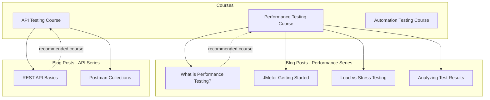

# List of plans and features

## To add offerta page 
## To add blog section linked to courses

## To add to each corse link to registration Google Form 
## To setup Copilot workflow to auto-translate 
## To add GitHub Action to atomatically send posts in to telegramm 